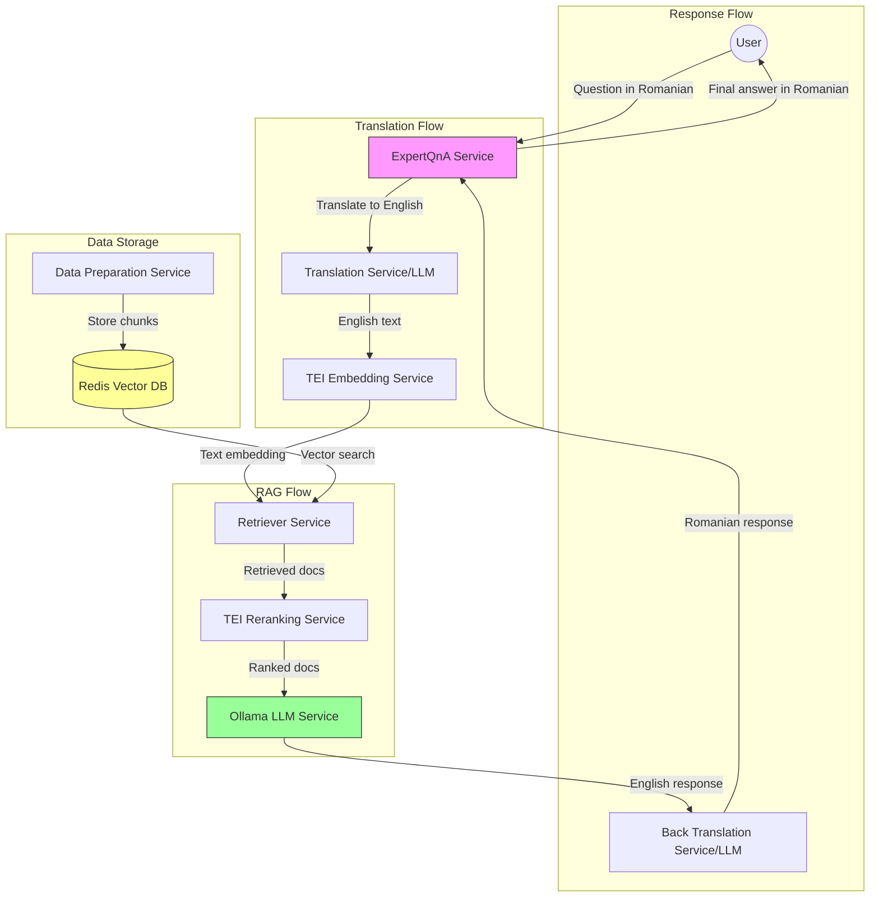

# Introduction

Tried to use Github Copilot Agent with cloned OPEA GenAIExamples and based on them generated the code to fullfill the scenario in Readme.md.

However it did not work well so I played with the examples to get a better picture of the OPEA and created the content manually using pieces from the examples.

# Use Case

Imagine this is an app used by an English speaking domain expert to communicate with a Romanian that does not know English or viceversa. The Expert is asked a question in Romanian and he/she will use RAG to answer the question and translation service to reply in Romanian. 

# Technical Uncertainty

Q: Will model llama3.2:1b be able to fullfil the task?

A: No. There are semantic looses when translating to English which result in wrong chunks selected. Also we have semantic loses when translating back to Romanian.

Q: How is embeding model defined?

A: Embedding model is defined as an environment variable to the command for embedding service

Q: How are embeddings initialized?

A: Embeddings are initalized using ingest endpoint in data preparation service

Q: How is translation model used in a comp?

A: We do not use a dedicated translation model but the same LLM model will be used for both translation and generating the answer but with different prompts.

Q: How answer from an LLM is sent to translation service and then back to user?

A: The answer from the LLM is sent back to same LLM with a prompt requiring translation to original language and then back to user.

Q: Can we use streaming between LLM translation and embedding service?

A: No, this means that entire pipeline is not using streaming. Unfortunately not sure why yet but this might be mitigated by creating a separate translation megaservice using only the LLM. However not in the scope of this project.

# Architecture



# Test drive

## Overview

To accomplish the above scenario we will set up Ollama to serve us the LLM, a data preparation service to help us ingest documents in Redis which will be used as a vector database, an embedding service that will be used by data preparation service to creating the embeddings for the chunks before stored to Redis and it will also be used to create the embeddings for the query before sent to retriever. We also have a reranking service to [rerank documents](https://github.com/opea-project/GenAIComps/blob/main/comps/rerankings/src/README.md) based on the given query

## Start the comps services

In order to use our expert mega service we need to start the services defined in [compose.yaml](ExpertQA/compose.yaml)

First initialize needed environment variables, do not forget to add your HuggingFace token to [set_env.sh](ExpertQA/set_env.sh)
```
source set_env.sh
```
then
```
docker compose up -d
```

## Load the pdf

*6007* is the port defined in [compose.yaml](ExpertQA/compose.yaml) for data preparation service. Change below if you changed compose file.

```
curl -X POST "http://${host_ip}:6007/v1/dataprep/ingest" \
    -H "Content-Type: multipart/form-data" \
    -F "files=@./nke-10k-2023.pdf"
```

## Download the model

THe model should be downloaded when ollama service starts but in case it doesn't use command below:

```
curl http://localhost:11434/api/pull -d '{ "model": "llama3.1:8b" }
```

you can list downloaded models
```
curl http://localhost:11434/api/tags
```

## Start the mega service

We need to use a wrapper that points to the ports of the started Ollama and OPEA comps services

```
python3 expertqna_wrapper.py

```

## Ask a question

```
curl http://${host_ip}:9999/v1/expertqna     -H "Content-Type: application/json"     -d '{
        "messages": "Câte procente au crescut venitul direct Nike?", "language": "romanian, ro"
    }'

```

The answer should show 14 %

```json
{"id":"chatcmpl-nxvXrZnatAsVUjAy5bdyYP","object":"chat.completion","created":1740254791,"model":"expertqna","choices":[{"index":0,"message":{"role":"assistant","content":"Conform rezultatelor căutării, veniturile NIKE Direct au crescut cu 14% de la 18,7 miliarde dolari în anul fiscal 2022 până la 21,3 miliarde dolari în anul fiscal 2023. Prin urmare, răspunsul este:\n\nVenitul direct NIKE a crescut cu 14%."},"finish_reason":"stop","metadata":null}],"usage":{"prompt_tokens":0,"total_tokens":0,"completion_tokens":0}}
```